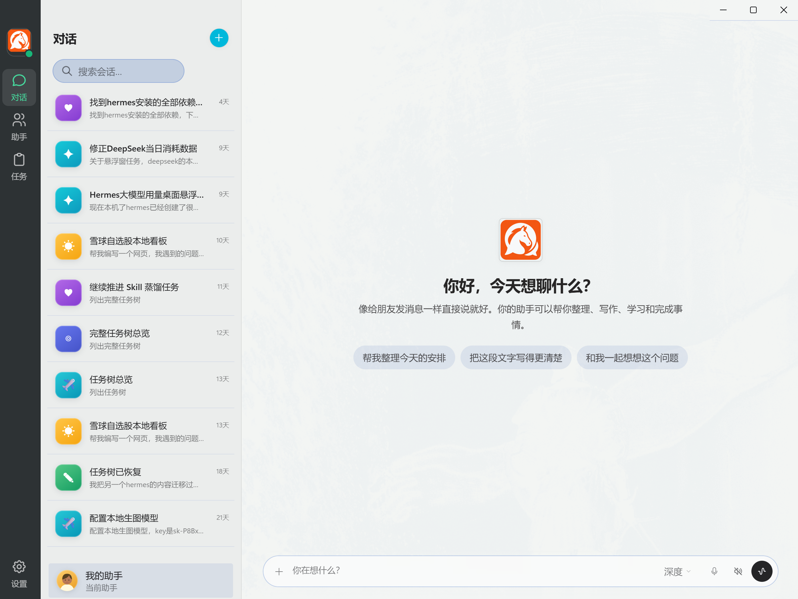
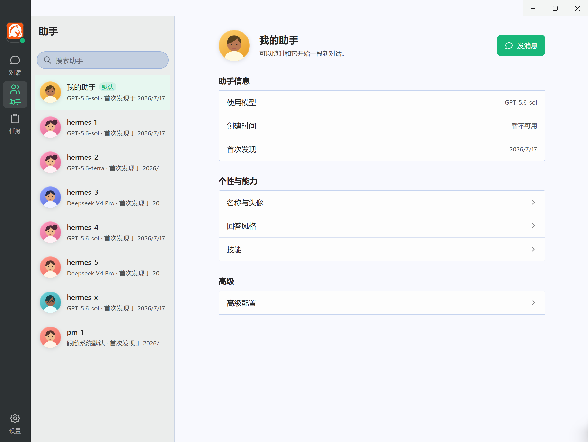
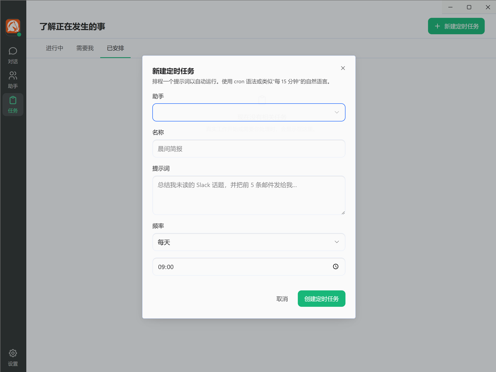
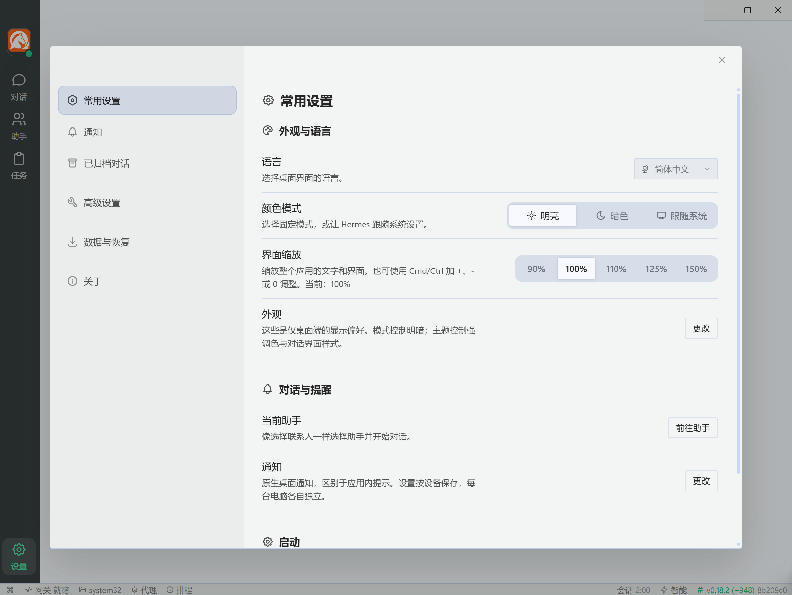
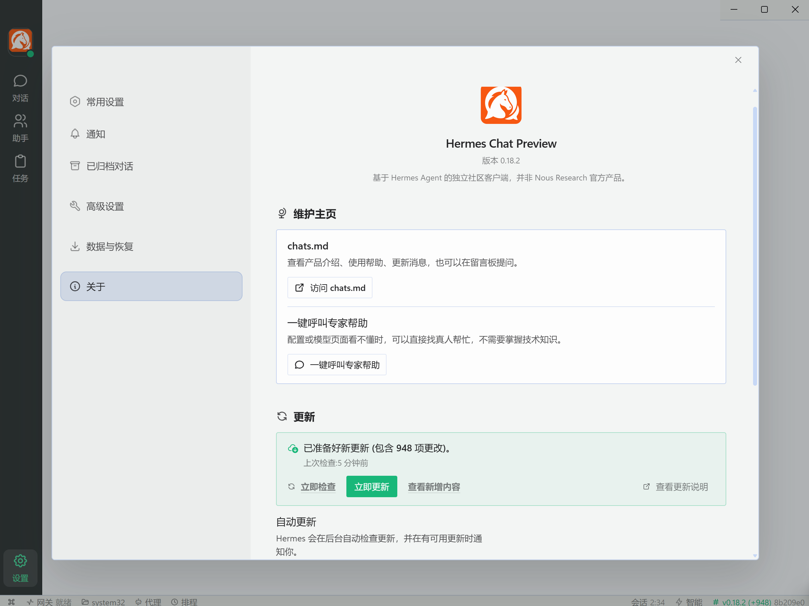

# 小马AI搭子

像使用聊天软件一样使用 Hermes。

小马AI搭子把 Hermes 的对话、助手、任务和聊天渠道整理成更容易理解的桌面界面，主要面向不熟悉技术配置的用户。

## 下载

请前往本仓库的 [Releases](../../releases) 页面下载 Windows 安装版。

产品介绍、使用帮助和留言板：[chats.md](https://chats.md/zh-cn/)

国内备用下载：[百度网盘](https://pan.baidu.com/s/1Q_B8rl3zmKE84S-W-XQVag?pwd=chat)，提取码：`chat`

## 界面预览

### 像聊天软件一样开始对话

### 像选择联系人一样选择助手

### 把需要持续完成的事情交给任务

### 常用设置集中摆放

### 更新和真人帮助都能直接找到

## 安装提醒

- 当前安装包未进行商业代码签名，Windows 可能显示“未知发布者”。请核对发布页提供的 SHA-256 后再安装。
- 语音转文字模型不包含在安装包中。第一次使用麦克风时，软件会先询问是否下载。
- 软件会优先复用电脑上已有的 Hermes，避免重复安装。

## 产品关系

小马AI搭子是基于 Hermes Agent 制作的独立社区桌面客户端，并非 Nous Research 官方产品。

本发布仓库只保存产品说明、第三方开源声明和安装包，不包含小马AI搭子的开发源码。

## 开源声明

Hermes Agent 采用 MIT License。安装包内保留了原版权声明、MIT License 和第三方开源声明，详情见 [THIRD_PARTY_NOTICES.md](./THIRD_PARTY_NOTICES.md)。
